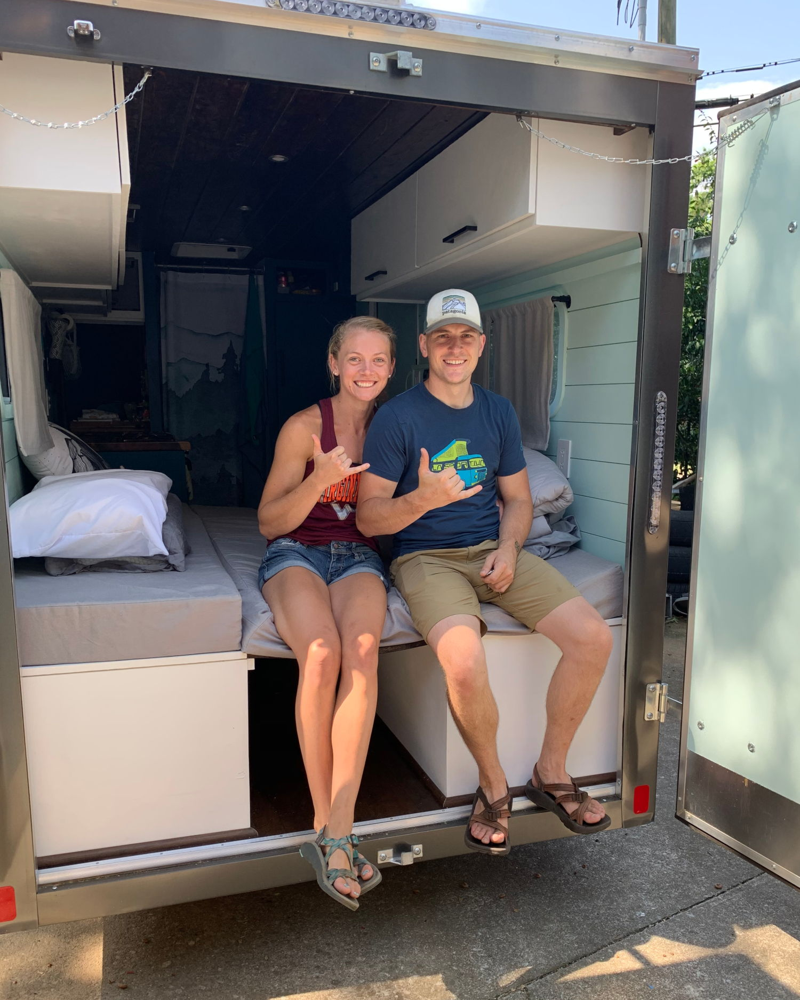
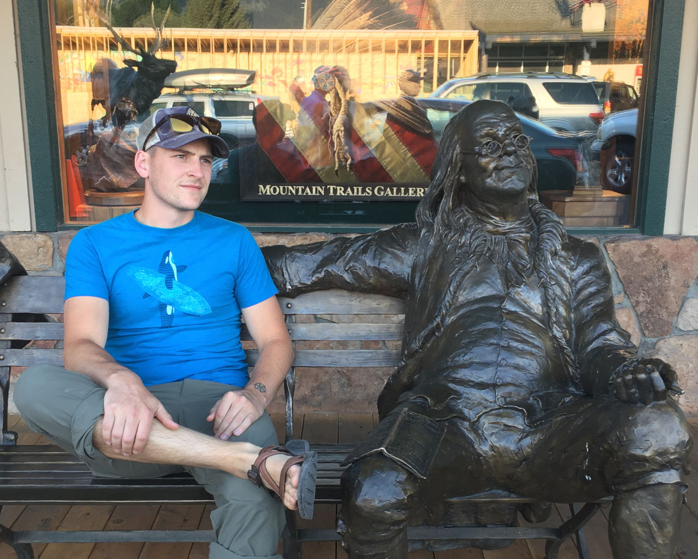
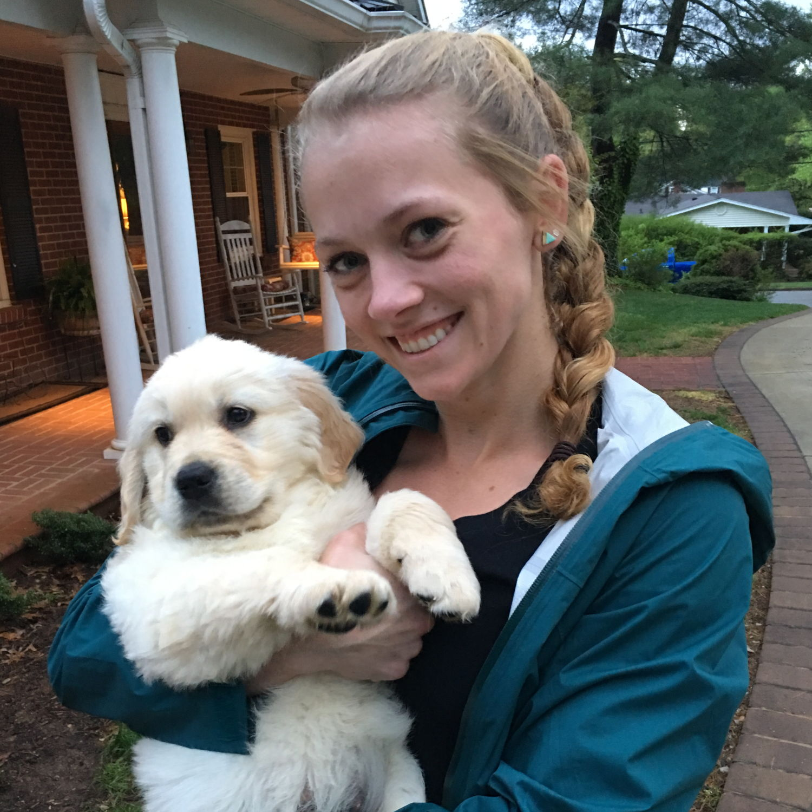
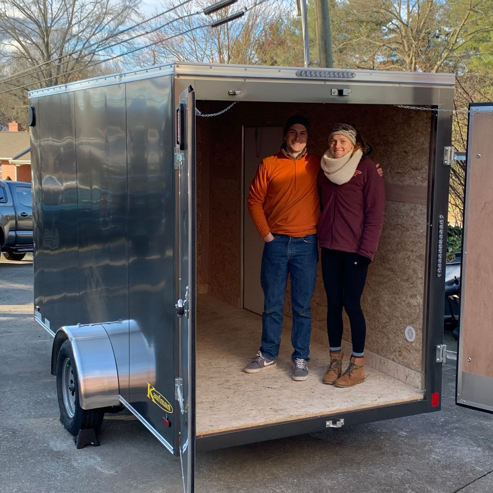
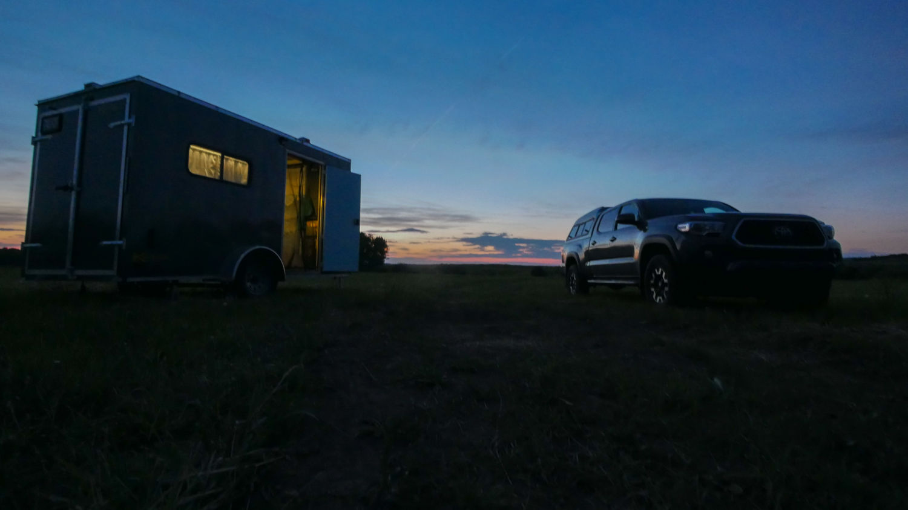

At the dawn of 2020, Bri and I purchased a 6x12ft cargo trailer.
Over the next 5 months we spent nearly every weekend making it into a custom built living space
that would change our lives.

Before we dive into the plan, the trip, and the rig, some introductions...

I'm Ben, born and raised in a small town in Southwest Virginia, named Salem.
They say there is a Salem in every state, and I'm the kind of guy you would expect from a
normal small town, certified average joe.
I grew up doing every team and extreme sport I could make time for, took a gruelling stab at
triathlons, and now primarily enjoy running and rock climbing.

That's Bri (with puppy [Kya!](https://www.instagram.com/goldenkya/)), I was lucky enough to meet her at our alma mater, Virginia Tech, during her blitz through an
engineering bachelors and masters. She was born in Charleston, SC and grew up all over the USA, but
primarily in Richmond, VA. She is whiz at most things she does, especially tugging her way up
a rock wall.

We met late in both our careers at Virginia Tech (I was a week away from graduation),
and to this day we bond over our love for Sriracha.

After college we moved to Raleigh, NC for around 3 years and went rock climbing at the
New River Gorge whenever it stopped raining. We quickly adopted the world's greatest cat
sisters, Tes and Cali, and life moved along swimmingly.

After a while we got tired playing chicken with the New River Gorge meteorologist
about the forecast and decided we wanted to do something different. We had the not
so crazy idea that we could build an RV, quit our jobs, and rock climb across the country
in search of greener pastures for our next place to live.

We concocted a plan to road trip around the USA, chasing 60-70 degree weather over an
8 month, life changing climbing adventure... but hold up...

As we all know, COVID-19 changed everyone's plans. When May rolled around we extended our stay in
Raleigh and lived the confusing life nearly everyone has come to know in 2020. After the national
parks opened up, we decided to take a risk and hit the road with our shiny new rolling home. We plan
to spend as much time as we can avoiding crowds and adventuring outside to keep the "RONA" away.

We packed up the rig, said our goodbyes, and took off for cliffs across the country.

`youtube: https://www.youtube.com/watch?v=ISJQRmPuG0k`

So here we are... we did it! Currently living out of our truck and trailer combo and
writing our experiences here on our blog Meandering.Rocks.

I'm sure I'll write a lot more interesting things in the future.

Ben
